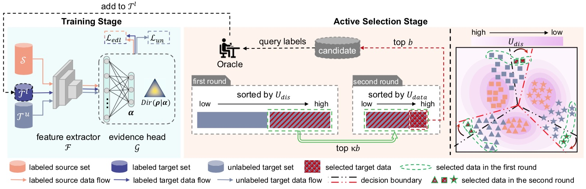

<div align="center">  
  
# Dirichlet-based Uncertainty Calibration for Active Domain Adaptation

[arxiv地址！！！Dirichlet-based Uncertainty Calibration for Active Domain Adaptation](https://arxiv.org/abs/). **[ICLR 2023 Spotlight]**.

**by [Mixue Xie](https://scholar.google.com/citations?user=2NHj3GsAAAAJ&hl=zh-CN&oi=ao), [Shuang Li](https://shuangli.xyz), [Rui Zhang](https://scholar.google.com/citations?user=8QbRVCsAAAAJ&hl=en) and [Chi Harold Liu](https://scholar.google.com/citations?user=3IgFTEkAAAAJ&hl=en)**

[](https://kiwixr.github.io/projects/vblc)&nbsp;&nbsp;
[](https://arxiv.org/abs/2211.12256)&nbsp;&nbsp;
[](https://www.bilibili.com/video/av692744964)&nbsp;&nbsp;
[](https://www.dropbox.com/s/pvb2701k2gr9cfb/aaai23poster.pdf?dl=0)&nbsp;&nbsp;

</div>
<!-- TOC -->

- [Dirichlet-based Uncertainty Calibration for Active Domain Adaptation](#dirichlet-based-uncertainty-calibration-for-active-domain-adaptation)
    - [Overview](#overview)
    - [Prerequisites Installation](#prerequisites-installation)
    - [Datasets Preparation](#datasets-preparation)
    - [Code Running](#code-running)
        - [Training](#training)
        - [Testing](#testing)
    - [Acknowledgments](#acknowledgments)
    - [Citation](#citation)
    - [Contact](#contact)

<!-- /TOC -->

## Overview

We propose a Dirichlet-based Uncertainty Calibration (DUC) approach for active domain adaptation (DA). It provides a novel perspective for active DA by introducing the Dirichlet-based evidential model and designing an uncertainty origin-aware selection strategy to comprehensively evaluate the value of samples.



## Prerequisites Installation

* For cross-domain *image classification* tasks, this code is implemented with `Python 3.7.5`, `CUDA 11.4` on `NVIDIA GeForce RTX 2080 Ti`. To try out this project, it is recommended to set up a virtual environment first.

    ```bash
    # Step-by-step installation
    conda create --name DUC_cls python=3.7.5
    conda activate DUC_cls

    # this installs the right pip and dependencies for the fresh python
    conda install -y ipython pip

    # this installs required packages
    pip install -r requirements_cls.txt
    ```

* For cross-domain *semantic segmentation* tasks, this code is implemented with `Python 3.7`, `CUDA 11.2` on `GeForce RTX 3090`. To try out this project, it is recommended to set up a virtual environment first.

    ```bash
    # Step-by-step installation
    conda create --name DUC_seg python=3.7
    conda activate DUC_seg

    # this installs the right pip and dependencies for the fresh python
    conda install -y ipython pip

    # this installs required packages
    pip install -r requirements_seg.txt
    ```


## Datasets Preparation

* **Image Classification Datasets**

    - Download [Office-Home Dataset](http://hemanthdv.org/OfficeHome-Dataset/)
    - Download [VisDA-2017 Dataset](https://github.com/VisionLearningGroup/taskcv-2017-public/tree/master/classification)
    - Download [DomainNet dataset](http://ai.bu.edu/M3SDA/#dataset) and [miniDomainNet's split files](https://github.com/KaiyangZhou/Dassl.pytorch/blob/master/DATASETS.md#miniDomainNet)

    Symlink the required dataset by running

    ```bash
    ln -s /path_to_home_dataset data/home
    ln -s /path_to_visda2017_dataset/ data/visda2017
    ln -s /path_to_domainnet_dataset data/domainnet
    ```

    The data folder should be structured as follows:
    ```
    ├── data/
    │   ├── home/     
    |   |   ├── Art/
    |   |   ├── Clipart/
    |   |   ├── Product/
    |   |   ├── RealWorld/
    │   ├── visda2017/
    |   |   ├── train/
    |   |   ├── validation/
    │   ├── domainNet/	
    |   |   ├── clipart/
    |   |   |—— infograph/
    |   |   ├── painting/
    |   |   |—— quickdraw/
    |   |   ├── real/	
    |   |   ├── sketch/	
    |   |——
    ```

* **Semantic Segmentation Datasets**

    - Download [Cityscapes Dataset](https://www.cityscapes-dataset.com/)
    - Download [GTAV Dataset](https://download.visinf.tu-darmstadt.de/data/from_games/)
    - Download [SYNTHIA Dataset](https://synthia-dataset.net/)

    Symlink the required dataset by running

    ```bash
    ln -s /path_to_cityscapes_dataset datasets/cityscapes
    ln -s /path_to_gtav_dataset datasets/gtav
    ln -s /path_to_synthia_dataset datasets/synthia
    ```

    Generate the label static files for GTAV/SYNTHIA Datasets by running

    ```bash
    python datasets/generate_gtav_label_info.py -d datasets/gtav -o datasets/gtav/
    python datasets/generate_synthia_label_info.py -d datasets/synthia -o datasets/synthia/
    ```

    **The data folder should be structured as follows:**

    ```
    ├── datasets/
    │   ├── cityscapes/     
    |   |   ├── gtFine/
    |   |   ├── leftImg8bit/
    │   ├── gtav/
    |   |   ├── images/
    |   |   ├── labels/
    |   |   ├── gtav_label_info.p
    │   └──	synthia
    |   |   ├── RAND_CITYSCAPES/
    |   |   ├── synthia_label_info.p
    │   └──	
    ```

## Code Running

### Training

Cross-domain image classification:
```bash
# training for Office-Home
python main.py --cfg configs/home.yaml

# training for VisDA-2017
python main.py --cfg configs/visda.yaml

# training for miniDomainNet
python main.py --cfg configs/miniDomainNet.yaml
```

Cross-domain semantic segmentation:
```bash
# training for GTAV to Cityscapes, DeepLab-v2
CUDA_VISIBLE_DEVICES=1 python3 main_seg.py --cfg configs/deeplabv2_r101_pixel_syn.yaml

# training for GTAV to Cityscapes, DeepLab-v3+
CUDA_VISIBLE_DEVICES=1 python3 main_seg.py --cfg configs/deeplabv2_r101_pixel_syn.yaml

# training for SYNTHIA to Cityscapes, DeepLab-v2
CUDA_VISIBLE_DEVICES=1 python3 main_seg.py --cfg configs/deeplabv2_r101_pixel_syn.yaml

# training for SYNTHIA to Cityscapes, DeepLab-v3+
CUDA_VISIBLE_DEVICES=1 python3 main_seg.py --cfg configs/deeplabv2_r101_pixel_syn.yaml
```

### Testing

Cross-domain image classification:
```bash
python test.py --cfg configs/home.yaml resume checkpint/v3plus_gtav_ra_5.0_precent/model_last.pth OUTPUT_DIR checkpint/v3plus_gtav_ra_5.0_precent
```

Cross-domain semantic segmentation:
```bash
python test.py -cfg configs/deeplabv2_r101_ours.yaml resume results/r101_g2c_ours
```

## Acknowledgments

This project is based on the following open-source projects. We thank their authors for making the source code publicly available.

- [Transferable-Query-Selection](https://github.com/thuml/Transferable-Query-Selection)
- [EADA](https://github.com/BIT-DA/EADA)
- [RIPU](https://github.com/BIT-DA/RIPU)


## Citation

If you find this work helpful to your research, please consider citing the paper:

```bibtex
@inproceedings{xie2023DUC,
  title={Dirichlet-based Uncertainty Calibration for Active Domain Adaptation},
  author={Xie, Mixue and Li, Shuang and Zhang, Rui and Liu, Chi Harold},
  booktitle={International Conference on Learning Representations (ICLR)},
  year={2023}
}
```

## Contact
If you have any problem about our code, feel free to contact mxxie@bit.edu.cn or describe your problem in Issues.

